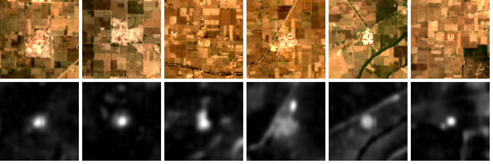

# Plan

**Goal:** find, check on the ground, and get formally recorded at least one settlement mound in the Thar margin of the Ghaggar–Chautang system that is not in any archaeological listing. The reasoning behind the area is in [AREA_SELECTION.md](AREA_SELECTION.md).

The pipeline turns free data into a short list of places worth a drive. People decide what's real.

```
Copernicus DEM ─┐
WorldCover ─────┼─► relief blobs ─► filters ─► score ─► review page ─► field check ─► report
Sentinel-2 ─────┘     (moundfinder scan)         (export)   (you + archaeologist)
CORONA / 1-inch maps ─────────────────────────► (Phase 4: historical cross-check)
Known sites ──────────► separate "rediscovered" from "new"
```

## Phase 0: Partner and set up (weeks 1–2)

- [ ] Write a one-page pitch and send it to 3–5 people. Possible partners:
  - Rajasthan Department of Archaeology & Museums (they record and protect state sites);
  - university departments that already work on the Ghaggar: BHU and Cambridge (the Land, Water and Settlement / TwoRains teams), Deccan College Pune, Kurukshetra University;
  - the ICAC team (Orengo) whose Cholistan method this pipeline follows.

  What you can offer them: free remote-sensing triage across an area they haven't surveyed, plus a field volunteer.
- [ ] Ask each one for their site gazetteer, or at least for which villages their surveys covered. Phase 1 depends on this more than anything else.

## Phase 1: The known-sites layer (weeks 1–4, alongside Phase 0)

A mound only counts as a discovery if it isn't already recorded. You don't need a perfect list, but you need a good one.

- [x] **First pass (41 sites):** ASI Jodhpur Circle protected mounds, rows of the Hanumangarh and Suratgarh GPS surveys, and Wikipedia/ASI coordinates for the Haryana sites. Sources, quality and gaps are in [data/known_sites/SOURCES.md](../data/known_sites/SOURCES.md).
- [ ] Get the full survey tables (about 85 + 79 GPS-located sites). Either allow the journal host in the environment's network settings, or drop the two PDFs into `data/raw/`.
- [ ] Still to add:
  - *Indian Archaeology – A Review* "Explorations" sections (sites by district);
  - Dalal 1980 for Bikaner;
  - Garge's 377-site Chautang basin monograph;
  - LWS/TwoRains reports;
  - Wikidata.
- [ ] Record each source's coordinate precision honestly. Many published sites are only placed to the nearest village.

## Phase 2: Calibrate on known ground (week 3)

- [x] Pilot tile N29E074 (Kalibangan, Pilibanga, Rawatsar), checked against 15 recorded sites that fall inside it. The results are in [Calibration so far](#calibration-so-far).
- [ ] Add a spectral (Sentinel-2) mound classifier trained on the recorded sites. This is needed for dune country, where elevation alone fails (see below).
- [ ] Scan one Haryana tile (`--aoi haryana_calibration --tiles N29E075`) as a second check in denser farmland.

## Phase 3: Sweep the primary area (weeks 4–6)

```bash
moundfinder -v scan --aoi thar_ghaggar_margin --out runs/thar --s2-top 300
moundfinder export runs/thar --top 100
```

The sweep covers six 1° tiles (~25,000 km² after the border buffer) and takes about 2 minutes per tile at `--s2-top 60`. Most of that time is spent on Sentinel-2 reads.

## Phase 4: Historical cross-check (weeks 5–8)

This is the step the original idea is built on: old imagery shows the ground before tractors and canals reached it.

- [ ] **Survey of India 1-inch maps (1910s–40s).** Download the sheets covering the top candidates from the [Zenodo collection](https://zenodo.org/communities/old-survey-of-india-maps/about). Mounds were drawn as hachured or spot-height features, sometimes labelled *theh* or *ruins*. Green et al. 2019 showed these correlate with old sites.
- [ ] **CORONA KH-4 (1960–72) and HEXAGON KH-9.** Get these from USGS EarthExplorer (free account). Use them on the top ~50 candidates and on the irrigated parts of the Indira Gandhi Canal command, where mounds may already have been levelled.
- [ ] **To build next in this repo:** a georeferencing tool (control points matched to Sentinel-2, then a polynomial warp) and a mound-symbol extractor for the 1-inch maps, following Berganzo-Besga et al. 2023. Use the scores to add `historical_evidence` to each candidate.

## Phase 5: Review (ongoing)

- [ ] Open `runs/<run>/review.html` and check each candidate against the satellite view. Mark it in `labels.csv` (`id,label`, with 1 = looks like a site, 0 = not).
- [ ] Common false positives and how they look:
  - **Village:** roofs, lanes, a tank. The pipeline flags it with WorldCover.
  - **Brick kiln:** an oval trench, a chimney shadow, red-brown spoil.
  - **Dune:** elongated, with other dunes nearby.
  - **Sand or soil heap:** fresh, with tracks leading to it.
  - **Tree clump:** dark green in every season.
  - **Water tank embankment:** a ring around a hollow.
- [ ] Once there are about 20 positives and 20 negatives, run `moundfinder train runs/<run> --labels labels.csv`. Rankings then come from a random forest on your own judgements plus the recorded sites.
- [ ] *Optional:* send the chip pairs to a vision model as a first-pass triage. That needs an API key and only adds a pre-sort, not a decision.

## Phase 6: Field verification (cool season, Nov–Feb)

Follow the [field protocol](FIELD_PROTOCOL.md). In short:

- Batch the trip: load `shortlist.kml` into Google Earth or Organic Maps, and plan 6–10 candidates a day along one route.
- At each mound: get the landowner's permission, photograph, take a GPS point, and look for surface pottery, brick, ash or slag. **Never dig or collect anything.**
- Ask villagers about old thehs nearby. It often leads to sites better than the candidate itself.

## Phase 7: Report

- [ ] For each confirmed site: coordinates, photos, size, condition, threats, and the local name. Send this to the Rajasthan Department of Archaeology & Museums and to your academic partner.
- [ ] Co-author a short note with the partner (e.g. *Man and Environment*, *Ancient Asia*, *Puratattva*, or a survey report). That is how the site enters the record.

## Pilot result: tile N29E074

This was run in the sandbox on 2026-10-09. The tile covers 29–30° N, 74–75° E: Kalibangan, Pilibanga, Rawatsar and Nohar.

- 8,611 relief blobs → 5,594 inside the AOI and outside the border belt.
- 69 blobs got Sentinel-2 checks: the top 60, plus every one on a recorded site.
- Kalibangan (8.5 m, 14 ha) ranks **5th**. The full check against the 15 recorded sites in this tile is in [Calibration so far](#calibration-so-far).
- None of the top six below match the 41 known sites; the nearest is 2.7 km away. But the Hanumangarh survey visited 574 sites, and only 13 of its rows are in the list so far. So they are not yet shown to be unrecorded.

Top six unmatched candidates. Coordinates are left out on purpose (see the field protocol). Re-run the scan to get them locally. Top row: Sentinel-2 in the dry season, red cross on the candidate. Bottom row: local relief, 0–6 m.



| # | id | score | height m | area ha | elong. | built | crop NDVI z | flags |
|---|---|---|---|---|---|---|---|---|
| 1 | `N29E074-03556` | 0.95 | 6.33 | 3.82 | 1.07 | 14% | -2.165 | – |
| 2 | `N29E074-03718` | 0.94 | 7.06 | 4.4 | 1.2 | 4% | -1.579 | – |
| 3 | `N29E074-05050` | 0.92 | 6.66 | 6.05 | 1.55 | 9% | -2.459 | – |
| 4 | `N29E074-04983` | 0.92 | 6.49 | 19.74 | 1.71 | 22% | -2.885 | – |
| 5 | `N29E074-03317` | 0.89 | 4.72 | 5.64 | 1.3 | 21% | -3.274 | – |
| 6 | `N29E074-04462` | 0.88 | 6.74 | 3.15 | 1.76 | 0% | -1.621 | – |

How to read this: #1 and #2 are bare, uncultivated 6–7 m bumps of a few hectares in irrigated fields, about 7 km north of Kalibangan. That is what an unploughed theh looks like. It is also what brick-kiln spoil or a sand heap looks like. This stretch of the Ghaggar is well surveyed, so they may well be recorded sites missing from the seed list. **None of these is a discovery until Phases 1, 4 and 6 say so.**

Lessons from the pilot, already built into the code:

- Modern villages topped the first ranking, because the DEM is a surface model and buildings add height. Land cover is now measured over the candidate's own footprint, and built-up candidates are penalised.
- Earth Search Sentinel-2 files already have the reflectance offset applied. The code reads the `earthsearch:boa_offset_applied` flag instead of applying the offset twice.

## Calibration so far

This is `moundfinder calibrate runs/test_N29E074` against the 15 recorded sites in the tile (out of 5,594 candidates). It re-matches against the current list, so no re-download is needed.

| Setting | Sites | Rank among 5,594 |
|---|---|---|
| Open fields, no village on top | Kalibangan, Karouti, Badopal, Sothi, Peer Sultan | **5, 70, 222, 263, 353** (top 6%) |
| Modern village on the mound | Pilibanga, Manak, Munda, Dabli ×2, Ramsaranarayan | 4,700–5,600 (village penalty). Ignoring the penalty, 250–1,650 |
| Dune field | Hardaswali-II, Moter-II, Badbirana-V | Missed or mid-table: 11–12 m of sand relief nearby swamps a 2–3 m mound |

What this means:

1. **In open farmland or bare plain, the elevation detector works.** Recorded mounds land in the top few percent, so unrecorded mounds like them should too. This is the setting of the pilot's top candidates.
2. **Villages on mounds are a separate stream.** Many old settlements here are still inhabited, so a modern village sits on the ancient mound. Those are rarely unrecorded and can't be checked without walking through someone's village, so the penalty stays. `calibrate` also prints the unpenalised rank.
3. **In dune country, elevation can't tell a mound from a dune.** The priority Bikaner–Churu tract is dune country, so the next build is a Sentinel-2 spectral classifier trained on these recorded sites: the Orengo et al. approach that worked in Cholistan's dunes. Old maps and CORONA (Phase 4) add a second, independent signal.

## Known limits

- **A 30 m DEM misses small sites.** Mounds under about 1.5 m tall or about 80 m across are invisible to the DEM stage. The historical maps and the spectral evidence have to catch those, which is Phase 4 work.
- **The heuristic score is hand-tuned.** It works in open plains (see above) but needs the classifier and labels before it can be trusted in dunes.
- **Sentinel-1 radar isn't used yet.** It was one of the two sensors in Orengo et al. and is worth adding for the dune tract.
